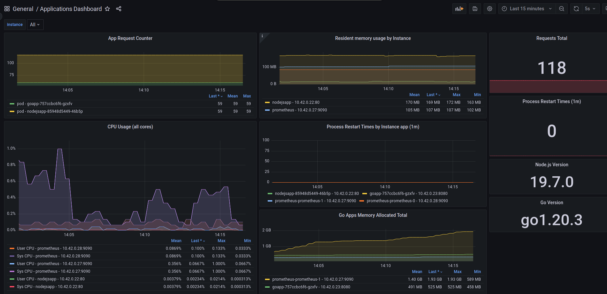

# k3s-example-project

This project is for developers who want to try and play and learn Kubernetes themselves but never had an opportunity to do so.

After installation, you will have a Kubernetes cluster with ArgoCD, Ingress, Prometheus, Grafana and 3 simple applications written in [NodeJS](https://github.com/madlopt/simple-nodejs-app), [Go](https://github.com/madlopt/simple-go-app) and [ReactPHP](https://github.com/madlopt/simple-react-php-app).
So, **you can learn how to deploy your own apps to Kubernetes and monitor them**, learn how to use ArgoCD, Prometheus and Grafana.
If you don't even know what is this, go [here](#what-are-the-argocd-ingress-prometheus-and-grafana).

I'm using here the lightweight Kubernetes distribution called **k3s** https://k3s.io.
So, **you can run it on your laptop** easily.
All the commands are tested on Ubuntu 22.04.
```bash
k3d version v5.4.6
k3s version v1.24.4-k3s1
```

The project includes/uses the following components:
* k3s, k3d
* kubectl
* ArgoCD
* Prometheus
* Grafana
* Example NodeJS app deployed to Kubernetes from here https://github.com/madlopt/simple-nodejs-app

### Prerequisites
Before proceeding, make sure you have the following software installed:

* kubectl
* k3d

### Installation
Run the following commands to install k3d:

```bash
sudo apt-get update
sudo apt-get install -y ca-certificates curl
sudo apt-get install -y apt-transport-https
sudo curl -fsSLo /etc/apt/keyrings/kubernetes-archive-keyring.gpg https://packages.cloud.google.com/apt/doc/apt-key.gpg
echo "deb [signed-by=/etc/apt/keyrings/kubernetes-archive-keyring.gpg] https://apt.kubernetes.io/ kubernetes-xenial main" | sudo tee /etc/apt/sources.list.d/kubernetes.list
sudo apt-get update
sudo apt-get install -y kubectl
curl -s https://raw.githubusercontent.com/k3d-io/k3d/main/install.sh | bash
k3d --version
```

Then clone the repository and run the following commands from the root of the project.

### Cluster Creation
Create a `k3d-dev-cluster` cluster by running the following command:

```bash
k3d cluster create dev-cluster --port 8080:80@loadbalancer --port 8443:443@loadbalancer
```

###  ArgoCD Installation
Create the ArgoCD namespace and deploy it:

```bash
kubectl create namespace argocd
kubectl create -n argocd -f argocd/install.yaml
```
We need Ingress for ArgoCD. You can create the ArgoCD ingress by running:

```bash
kubectl apply -f ingress/ingress.yaml -n argocd
```
Get the initial admin password by running:

```bash
kubectl -n argocd get secret argocd-initial-admin-secret -o jsonpath="{.data.password}" | base64 -d && echo
```
If it says `Error from server (NotFound): secrets "argocd-initial-admin-secret" not found` wait a bit, probably ArgoCD is not ready yet.

You can access the ArgoCD dashboard by visiting http://localhost:8080/argocd, login is `admin`, check it after running the command above.

###  Prometheus
Deploy Prometheus using one of the following commands:

```bash
kubectl create -f prometheus/bundle.yaml
```
Create the Prometheus service account and role binding:

```bash
kubectl apply -f prometheus/prom-rbac.yaml
```
Deploy the Prometheus instance:

```bash
kubectl apply -f prometheus/prometheus.yaml
```
You can check if the Prometheus instance is running by running:

```bash
kubectl get prometheus
```
Look at the `AVAILABLE` it should be `True`

Create the Prometheus service:

```bash
kubectl apply -f prometheus/prometheus-service.yaml
```
To access the Prometheus dashboard, run:

```bash
kubectl port-forward svc/prometheus 9090
```
Visit http://localhost:9090 to view the dashboard.

Create the Prometheus ServiceMonitor:

```bash
kubectl apply -f prometheus/prometheus-servicemonitor.yaml
```

### Grafana

To install Grafana, follow these steps:

Create the necessary Kubernetes resources using the following commands:
```bash
kubectl create -f grafana/datasources-config.yaml
kubectl create -f grafana/dashboard-providers-config.yaml
kubectl create -f grafana/dashboard-config.yaml
```
Apply the Grafana YAML file where are its service, deployment, and volume:
```bash
kubectl apply -f grafana/grafana.yaml
```
Wait a few minutes for Grafana to be deployed.

Forward the Grafana port to your local machine using the following command:

```bash
kubectl port-forward service/grafana 3000:3000
```
Wait a bit then open your web browser and go to http://localhost:3000.

Log in to Grafana using the default username and password (admin/admin), then change the password to a secure one.

You will see the only one `Applications Dashboard` in the list of available dashboards. It won't have any data because we haven't deployed the NodeJS app yet.


### Node.js Application
To install the Node.js application, follow these steps:

Create the app in Kubernetes using the following command:
```bash
kubectl create -n argocd -f nodejsapp/application.yaml
```
Wait a few minutes for the application to be deployed.
### Go Application
To install the Go application, follow these steps:

```bash
kubectl create -n argocd -f goapp/application.yaml
```
Wait a few minutes for the application to be deployed.
### ReactPHP Application
To install the ReactPHP application, follow these steps:

```bash
kubectl create -n argocd -f phpapp/application.yaml
```
Wait a few minutes for the application to be deployed.

Got to http://localhost:8080/argocd/applications you will see the apps in the list of applications.

Go to http://localhost:9090/targets, and you will see the apps in the list of targets (be sure you're forwarding port 9090).

And finally, check the Grafana dashboard http://localhost:3000, you will see the data coming from the apps.

That's it!


## Other useful commands


### Cluster Deletion
To delete the cluster, run:

```bash
k3d cluster delete --all
```
Be aware, it will remove everything you have in the cluster. In our case it's all because we're using only one cluster.
### Namespace & Project Creation
If you need to create a development namespace, run:

```bash
kubectl create namespace dev
```
To create a new project in the default namespace, run:

```bash
kubectl create -n default -f project/development-project.yaml
```

You can do the same from ArgoCD UI.

### Grafana
To use Grafana, follow these steps:

Forward the Grafana port to your local machine using the following command:
```bash
kubectl port-forward service/grafana 3000:3000
```
Open your web browser and go to http://localhost:3000.

Log in to Grafana using your username and password.

You can now create and manage your dashboards.

If you need to change the Prometheus datasource (the default is `http://prometheus:9090`), do it by navigating to Data Sources in Grafana and adding a new one.
If you don't know but need your Prometheus URL, run the following command to get the IP for the URL:

```bash
kubectl get service

NAME                  TYPE           CLUSTER-IP      EXTERNAL-IP   PORT(S)          AGE
kubernetes            ClusterIP      10.43.0.1       <none>        443/TCP          162m
prometheus-operator   ClusterIP      None            <none>        8080/TCP         6m42s
prometheus-operated   ClusterIP      None            <none>        9090/TCP         6m24s
prometheus            ClusterIP      10.43.149.122   <none>        9090/TCP         5m59s
grafana               LoadBalancer   10.43.85.221    172.20.0.2    3000:30559/TCP   3m36s
```
Look for the prometheus service and note the ClusterIP address.
For our case it will be `http://10.43.149.122:9090`

Also, you can import the Prometheus dashboard by going to https://grafana.com/grafana/dashboards/3662-prometheus-2-0-overview/ and using the dashboard ID `3662`, it has a lot of beautiful graphs to look and play with.

### Node.js Application

To see what Prometheus metrics looks like, forward the `80` port from Node.js app to your local machine using the following command:
```bash
kubectl port-forward service/nodejsapp --namespace=default 80:80
```
Then go to http://localhost/metrics, and you will see the metrics.

To delete the application, run the following command:

```bash
kubectl delete app nodejsapp -n argocd
```
You can delete and forward ports in the same way with the rest of the apps.


### Important Paths
Here are some important paths that you may need to access:

* /var/lib/grafana/dashboards: Contains Grafana dashboards
* /etc/grafana/provisioning/dashboards: Contains dashboard provider YAML files
* /etc/grafana/provisioning/datasources: Contains datasource YAML files

### Restarting Deployments
To restart any deployment, use the following command:

```bash
kubectl rollout restart deployment <deployment_name> -n <namespace>
```
### Deleting Resources
To delete all resources in the default namespace, use the following command:
```bash
kubectl delete all --all --namespace default
```
Remember this command along with deleting clusters command!

It will help you clean up your cluster. k3s it's a lightweight alternative to k8s, but it's still a huge tool which can use the whole of your resources and your machine will stuck. Especially when you're playing with memory in yamls.

### What are the ArgoCD, Ingress, Prometheus, and Grafana?

**ArgoCD** is a tool for automating continuous delivery of applications to Kubernetes clusters. It uses GitOps methodology to synchronize the desired state of the application with the actual state in the cluster.

**Ingress** is a Kubernetes resource that provides external access to the services running inside a cluster. It is a way to route incoming traffic to the correct service and also allows for load balancing and SSL termination.

**Prometheus** is a monitoring and alerting tool for Kubernetes and other systems. It collects metrics from various sources, stores them in a time-series database, and allows users to query and visualize the data. It also has a built-in alerting system that can send notifications based on specific conditions.

**Grafana** is a tool for visualizing and analyzing data from various sources, including Prometheus. It provides a flexible and customizable dashboard that allows users to create graphs, charts, and other visualizations to monitor the performance of their systems. Grafana also has a built-in alerting system that can trigger notifications based on specific thresholds.

### What are the k3s and k8s?

**K8S**, or Kubernetes, is an open-source container orchestration platform that automates the deployment, scaling, and management of containerized applications. It was originally developed by Google and is now maintained by the Cloud Native Computing Foundation (CNCF). Kubernetes provides a way to deploy and manage containerized applications across multiple nodes and multiple clusters, making it a popular choice for deploying microservices-based architectures.

**K3S** is a lightweight Kubernetes distribution that is designed for use in resource-constrained environments, such as edge computing devices, IoT devices, and other small compute platforms. K3S is designed to be easy to install and operate, with a minimal footprint that requires less memory and CPU resources than a full Kubernetes cluster. K3S includes many of the same features as Kubernetes, but with a smaller footprint and a simplified configuration process.

### Just FYI

If you use the prom-client library https://github.com/siimon/prom-client, please look at the memory leak fix I've made here https://github.com/madlopt/simple-nodejs-app, it's simple and silly, but it could save you a lot of time.
